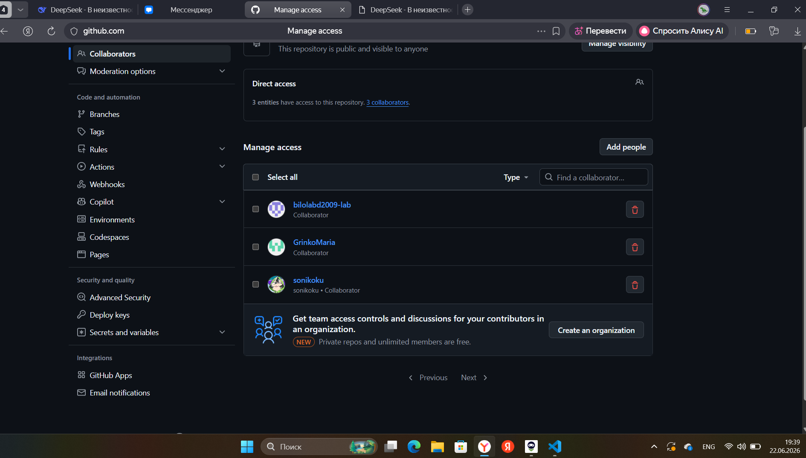

# team-project

# Практическая работа: совместная разработка на GitHub

## Состав команды
| Участник | GitHub | Роль |
|---|---|---|
| Гурняк Александра| aleksandra-gur | Владелец репозитория |
| Гринько Мария | GrinkoMaria | Разработчик |
| Станчинская София | sonikoku | Разработчик |
| Абдуллаев Биллолидин | bilolabd2009-lab | Проверяющий |

## Цель работы
Кратко описать цель практической работы.

## Используемые инструменты
- Git;
- GitHub;
- VS Code.

## Описание
Это учебный командный проект для практики GitHub.

## Ход работы

### 1. Создание репозитория и добавление участников

### 2. Клонирование проекта

## Проблема: забыли сделать Pull

Мы увидели, что если участник работает со старой версией проекта, Git может не разрешить отправить изменения сразу. Сначала нужно получить актуальную версию с GitHub, объединить изменения и только потом отправлять свои.

## Статус проекта

Проект находится в активной разработке: команда студентов изучает GitHub, Pull Request и разрешение конфликтов.

## Версия проекта
Текущая версия: 1.0.0

## Разница между Fetch и Pull
Fetch позволяет увидеть, что на GitHub появились новые изменения, но не
применяет их сразу к локальным файлам. Pull получает изменения и сразу
объединяет их с текущей рабочей версией.
