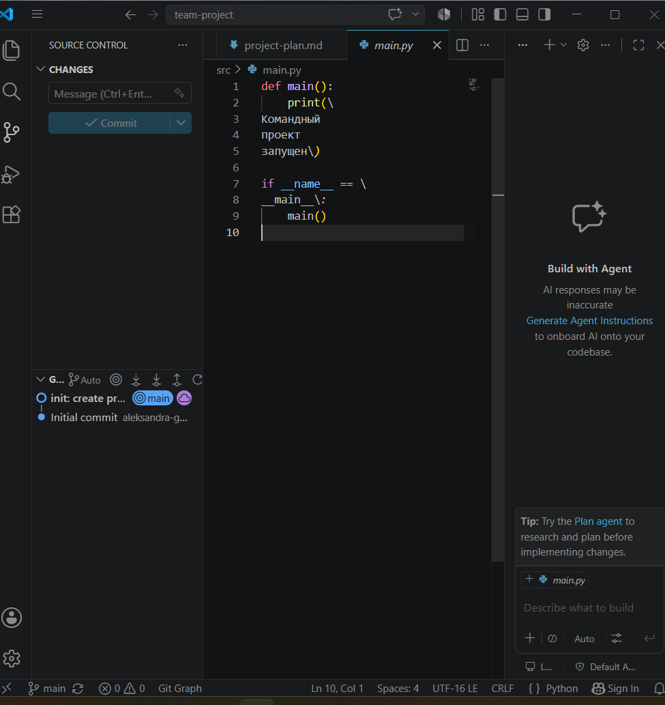
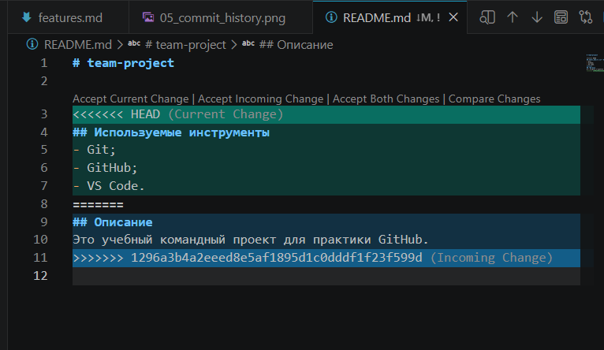
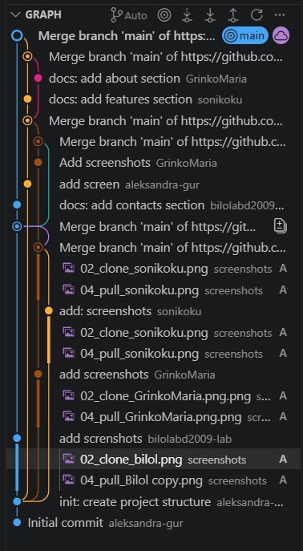

# team-project

# Практическая работа: совместная разработка на GitHub

## Состав команды
| Участник | GitHub | Роль |
|---|---|---|
| Гурняк Александра| aleksandra-gur | Владелец репозитория |
| Гринько Мария | GrinkoMaria | Разработчик |
| Станчинская София | sonikoku | Разработчик |
| Абдуллаев Биллолидин | bilolabd2009-lab | Проверяющий |

## Цель работы
Кратко описать цель практической работы.

## Используемые инструменты
- Git;
- GitHub;
- VS Code.

## Описание
Это учебный командный проект для практики GitHub.

## Ход работы

### 1. Создание репозитория и добавление участников
Создатель репозитория настроил совместный доступ к проекту, добавив остальных участников команды в качестве Collaborators в настройках GitHub. Каждый участник получил и принял приглашение на email.

### 2. Клонирование проекта
После получения доступа каждый участник команды клонировал удаленный репозиторий на свое локальное устройство с помощью команды `git clone`.
*   Скриншот участника Bilol: ``
*   Скриншот участника GrinkoMaria: ``
*   Скриншот участника sonikoku: ``

### 3. Первый push
Один из участников внес стартовые изменения в локальный репозиторий и успешно отправил их на GitHub, зафиксировав базовую структуру проекта.

### 4. Работа с изменениями других участников
Участники команды начали параллельно работать над проектом в ветке `main`. Каждый создал и модифицировал свои текстовые или программные файлы, отражающие их часть работы. Перед отправкой своих файлов каждый участник запрашивал изменения из общего репозитория (`git pull`).
*   Скачивание изменений Bilol: ``
*   Скачивание изменений GrinkoMaria: ``
*   Скачивание изменений sonikoku: ``

### 5. Ошибка при Push без Pull
**Описание проблемы:** При попытке отправить локальные коммиты на GitHub сервер отклонил запрос (`push rejected`), так как удаленная ветка содержала коммиты других участников, которых еще не было на локальном компьютере.
**Решение:** Сначала была выполнена команда `git pull` для синхронизации локальной копии с сервером, после чего отправка стала возможной.

### 6. Merge conflict
**Описание проблемы:** Возник конфликт слияния (Merge Conflict), когда два участника одновременно отредактировали одну и ту же строчку в одном и том же файле и попытались отправить изменения. Git не смог автоматически решить, какую версию оставить.
**Решение:** Конфликтный файл был открыт в редакторе кода. Были вручную удалены маркеры конфликта (`<<<<<<<`, `=======`, `>>>>>>>`), выбрана финальная корректная версия кода, после чего изменения были закоммичены и отправлены в репозиторий.
*   Появление конфликта: ``
*   Разрешение конфликта: ``

### 7. Работа с ветками
Чтобы избежать постоянных конфликтов в основной ветке `main`, команда перешла на использование Git Flow. Каждый участник создал свою изолированную ветку для выполнения задач.

### 8. Pull Request
Участники загрузили свои ветки на GitHub и создали запросы на слияние (Pull Requests) в ветку `main`. Другие члены команды провели код-ревью (Review), проверили код на ошибки и одобрили слияние, после чего ветки были успешно объединены.
*   **Создание Pull Requests:**
    *   Создан GrinkoMaria: ``
    *   Создан sonikoku: ``
    *   Создан Bilol: ``
*   **Проверка (Review):**
    *   Ревью для Bilol: ``
    *   Ревью для GrinkoMaria: ``
    *   Ревью для sonikoku: ``
*   **Успешное слияние (Merged):**
    *   Слияние ветки GrinkoMaria: ``
    *   Слияние ветки sonikoku: ``
    *   Слияние ветки Bilol: ``

### 9. Конфликт в Pull Request
**Описание проблемы:** При попытке влить одну из веток через интерфейс GitHub возник конфликт слияния (PR Conflict), так как целевая ветка `main` уже ушла вперед и содержала изменения в тех же строках.
**Решение:** Конфликт был разрешен локально или прямо в веб-интерфейсе GitHub (через встроенный редактор конфликтов), после чего Pull Request был успешно закрыт.
*   Конфликт в PR: ``
*   Разрешение конфликта в PR: ``

### 10. Fetch и Pull
В процессе работы команда изучила разницу между получением данных:
*   `git fetch` — скачивает новые данные из удаленного репозитория, но не объединяет их с локальным кодом (безопасный просмотр изменений).
*   `git pull` — скачивает данные и сразу автоматически пытается влить их в текущую локальную ветку (эквивалентно `fetch` + `merge`).
*   Получение изменений GrinkoMaria: ``
*   Получение изменений sonikoku: ``
*   Получение изменений Bilol: ``

## История коммитов
На скриншоте представлена полная и чистая история коммитов команды, отображающая последовательное добавление фич, создание веток и успешные слияния Pull Request.

## Вывод
В ходе выполнения практической работы команда успешно освоила инструменты коллективной разработки:
*   **Что получилось:** Нам удалось развернуть общий репозиторий, настроить права доступа, организовать параллельную работу трех участников (Bilol, GrinkoMaria, sonikoku) и собрать проект воедино.
*   **Какие проблемы возникли:** В процессе работы мы столкнулись с блокировкой отправки коммитов (`push rejected`) и конфликтами слияния как локально, так и внутри Pull Request на GitHub.
*   **Что было самым сложным:** Наибольшую трудность вызвало ручное разрешение конфликтов (Merge Conflicts), когда требовалось внимательно сопоставить локальные и удаленные изменения, чтобы не удалить полезный код коллег.
*   **Зачем нужны ветки и Pull Request:** Ветки позволяют вести разработку изолированно, не ломая стабильную версию в `main`. Pull Request необходим для совместного обсуждения кода (код-ревью), проверки качества изменений и безопасного слияния веток.
*   **Почему важно делать Pull перед началом работы:** Команда `git pull` (или `fetch`) перед началом написания кода гарантирует, что работа ведется на актуальной версии проекта. Это минимизирует количество конфликтов слияния в будущем и экономит время команды.

## Проблема: забыли сделать Pull

Мы увидели, что если участник работает со старой версией проекта, Git может не разрешить отправить изменения сразу. Сначала нужно получить актуальную версию с GitHub, объединить изменения и только потом отправлять свои.

## Статус проекта

Проект находится в активной разработке: команда студентов изучает GitHub, Pull Request и разрешение конфликтов.

## Версия проекта
Текущая версия: 1.0.0

## Разница между Fetch и Pull
Fetch позволяет увидеть, что на GitHub появились новые изменения, но не
применяет их сразу к локальным файлам. Pull получает изменения и сразу
объединяет их с текущей рабочей версией.

Вот ёмкие и готовые к вставке ответы (можно скопировать прямо в комментарии или `README.md`):

---

1. **Репозиторий** — это хранилище кода с историей всех изменений (включая файлы, папки, коммиты и ветки).

2. **Локальный** — у тебя на компьютере, **удалённый** — на сервере (например, GitHub/GitLab). Локальный для работы, удалённый для синхронизации и совместного доступа.

3. **Pull** — забирает изменения с удалённого репозитория и сразу сливает (merge) их с твоей текущей веткой.

4. **Push** — отправляет твои локальные коммиты в удалённый репозиторий.

5. **Fetch** — только скачивает изменения, но **не сливает** их с твоей веткой; **Pull** = Fetch + Merge.

6. **Ветка** — это изолированная линия разработки, позволяющая вести параллельную работу независимо от основной кодовой базы.

7. В `main` работают сразу несколько человек — легко сломать код или создать конфликты. Ветки дают свободу экспериментировать без риска для основной версии.

8. **Pull Request (PR)** — это запрос на вливание изменений из одной ветки в другую (часто в `main`) с возможностью обсуждения и проверки кода.

9. Проверка PR другим участником помогает найти ошибки, улучшить качество кода, соблюсти стандарты и избежать проблем при слиянии.

10. **Merge conflict** — ситуация, когда Git не может автоматически объединить изменения из разных веток, потому что они затрагивают одни и те же строки по-разному.

11. Конфликт возникает, когда в разных ветках изменены одни и те же участки кода, и Git не знает, какой вариант считать правильным.

12. Оставлять нужно тот вариант, который решает задачу корректно, часто — путём ручного редактирования, обсуждения с автором и тестирования после разрешения конфликта.

13. Если забыть сделать Pull, твоя локальная ветка устареет, и при Push будет конфликт, который придётся разрешать перед отправкой.

14. Маленькие коммиты проще проверять, откатывать, понимать логику изменений и находить баги (один коммит — одна логическая задача).

15. **Самое сложное** — разрешать merge-конфликты, особенно когда изменения затрагивают логику проекта, и нужно понимать чужой код. (Если хочешь, можешь заменить на своё конкретное затруднение).